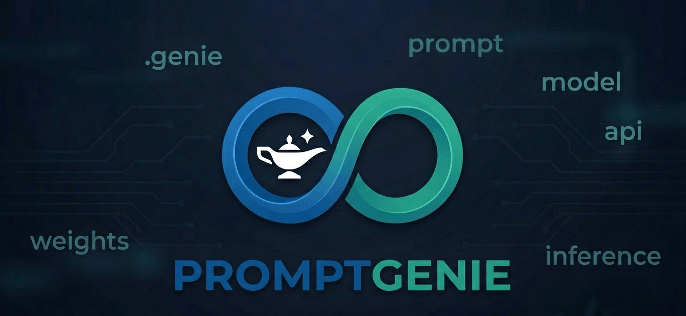

<p align="center">
  
</p>

# PromptGenie

**Secure prompt engineering for AI agents and engineering teams.**

PromptGenie is a CLI that turns rough task descriptions into optimised, tool-specific, security-checked prompts — with a built-in linter, security scanner, diff engine, test runner, model benchmarker, context pack system, workflow engine, CI integration, quality scoring, and token estimation.

---

## Why

Most prompt engineering is done by hand, rewritten constantly, and never tested. Prompts for agentic tools (Claude Code, Cursor, Devin) are especially risky: a vague scope or missing stop condition can cause scope creep, destructive edits, or unintended deployments.

PromptGenie makes prompts:

- **Structured** — section-by-section output matched to the target tool's requirements
- **Linted** — catches vague verbs, missing scope, broad tasks, and agentic risks before you send
- **Scanned** — detects secrets, prompt injection patterns, and unsafe agent permissions
- **Diffed** — compare two versions with token delta, score delta, section changes, and risk changes
- **Tested** — declarative unit tests assert quality, safety, structure, and content before you ship
- **Benchmarked** — run prompts against real Claude models and score responses across 6 rubric dimensions
- **Context-aware** — reusable project context packs inject stack, architecture, pitfalls, and style into every prompt
- **Workflow-driven** — break complex tasks into staged prompt chains with approval gates, handoffs, and per-step scope locks
- **CI-integrated** — GitHub Actions workflow and pre-commit hooks keep bad prompts out of your repo
- **Machine-readable** — `--format json` and `--format sarif` on every lint and scan for CI pipelines and GitHub code scanning
- **Scored** — rates every prompt across 7 quality dimensions
- **Repeatable** — YAML model profiles, templates, and context packs versioned alongside your code

---

## Install

```bash
git clone https://github.com/mylesagnew/promptgenie.git
cd promptgenie
python3 -m venv .venv && source .venv/bin/activate
pip install -e .
```

---

## Commands

| Command | Description |
|---|---|
| `generate` | Build an optimised prompt from a rough task description |
| `lint` | Check a prompt file for quality and structural issues |
| `scan` | Scan a prompt file for security risks |
| `diff` | Compare two prompt versions — token, score, section, and risk delta |
| `adapt` | Translate a prompt from one target profile to another |
| `test` | Run a declarative prompt test suite |
| `benchmark` | Run a prompt against a Claude model and score the output |
| `workflow` | Generate a staged prompt chain from a `.workflow.yaml` file |
| `pack list` | List available context packs |
| `pack show` | Preview a context pack's rendered content |
| `pack inject` | Inject a context pack into an existing prompt file |
| `pack init` | Create a new blank context pack |
| `ci init` | Scaffold GitHub Actions and pre-commit hooks into a project |
| `ci status` | Check which CI integrations are active |
| `list-targets` | Show all available model profiles |
| `list-templates` | Show all available prompt templates |

---

### `generate`

Generate an optimised prompt from a rough task description.

```bash
promptgenie generate "refactor the auth module to use JWT" \
  --target claude-code \
  --mode exhaustive
```

```bash
promptgenie generate "threat model the payment API" \
  --target claude \
  --template threat-model \
  --context "Django REST API, Stripe integration, PostgreSQL" \
  --out payment-threat-model.md
```

**Options:**

| Flag | Description |
|---|---|
| `--target`, `-t` | Target AI tool. Auto-inferred if omitted. |
| `--template`, `-T` | Template ID (e.g. `threat-model`, `agentic-task`). Auto-inferred if omitted. |
| `--context`, `-c` | Project or task context. |
| `--constraints`, `-x` | Constraints or forbidden actions. |
| `--output-format`, `-f` | Desired output format for the generated prompt. |
| `--mode`, `-m` | `minimal` / `standard` / `exhaustive` |
| `--out`, `-o` | Save prompt to file. |
| `--pack`, `-p` | Context pack ID to inject (e.g. `react-supabase-app`). |
| `--no-lint` | Skip inline lint pass. |
| `--no-scan` | Skip inline security scan. |

**Modes:**

| Mode | Use for |
|---|---|
| `minimal` | Reasoning models, simple tasks, low token budget |
| `standard` | Default — balanced structure and detail |
| `exhaustive` | Agentic tools, complex tasks, security-critical workflows |

---

### `lint`

Check a prompt file for quality and structural issues.

```bash
# Default rich terminal output
promptgenie lint my-prompt.md

# Machine-readable JSON (CI scripts, dashboards)
promptgenie lint my-prompt.md --format json

# SARIF for GitHub code scanning
promptgenie lint my-prompt.md --format sarif --out lint-results.sarif
```

**What it checks:**

- Vague verbs (`help`, `fix`, `improve`, `make better`)
- Multiple tasks chained in one prompt
- Missing target AI tool
- Overly broad scope (`fix the whole app`, `update all files`)
- Missing stop conditions (agentic prompts)
- Missing scope definition
- Missing forbidden actions
- Missing output format
- Missing success criteria
- Dangerous agentic instructions (`do whatever it takes`, `deploy to production`, `drop the table`)

Exits `1` if any HIGH severity issues are found — safe to use in CI.

**Options:**

| Flag | Description |
|---|---|
| `--format` | Output format: `rich` (default) / `json` / `sarif` |
| `--out`, `-o` | Write output to file instead of stdout |

---

### `scan`

Scan a prompt file for security risks.

```bash
# Default rich terminal output
promptgenie scan my-prompt.md

# Machine-readable JSON
promptgenie scan my-prompt.md --format json

# SARIF for GitHub code scanning upload
promptgenie scan my-prompt.md --format sarif --out scan-results.sarif
```

**What it detects:**

| Category | Examples |
|---|---|
| Secrets | API keys, tokens, AWS credentials, private keys embedded in prompt |
| Prompt injection | Instruction overrides, system prompt extraction, output suppression |
| Agent permissions | Unrestricted filesystem access, arbitrary code execution, unsupervised publishing |
| RAG risks | Instructions that follow retrieved content, untrusted input pipelines |
| Chained risks | Web fetch + action (email/deploy/write) without approval gate |

Exits `1` on CRITICAL or HIGH findings — safe to use in CI or pre-commit hooks.

The scanner reports the **class** of secret found, never the secret value itself.

**Options:**

| Flag | Description |
|---|---|
| `--format` | Output format: `rich` (default) / `json` / `sarif` |
| `--out`, `-o` | Write output to file instead of stdout |

---

### `diff`

Compare two prompt versions side-by-side — tokens, quality scores, section changes, lint changes, and security finding changes.

```bash
promptgenie diff v1.md v2.md --target claude-code
promptgenie diff v1.md v2.md --target claude-code --unified
```

**What it shows:**

| Panel | Content |
|---|---|
| **Summary** | Tokens, quality score, lint count, security findings — A vs B with delta |
| **Quality Score Breakdown** | All 7 dimensions side-by-side with per-dimension delta |
| **Section Changes** | Each `## Section` marked ADDED / REMOVED / CHANGED / UNCHANGED with inline line diffs |
| **Lint Changes** | Issues resolved in v2 vs new issues introduced |
| **Security Changes** | Findings resolved in v2 vs new findings introduced |

**Options:**

| Flag | Description |
|---|---|
| `--target`, `-t` | Profile to use for quality scoring (default: `claude`) |
| `--unified`, `-u` | Show full colour-coded unified diff |

---

### `adapt`

Translate a prompt written for one target into another — rewriting model-specific language, preserving agentic safety sections by default, and adding sections required by the destination profile.

```bash
# Claude Code → Cursor (same agentic category — all safety sections kept)
promptgenie adapt my-prompt.md --from claude-code --to cursor

# Claude Code → ChatGPT (safety sections preserved by default)
promptgenie adapt my-prompt.md --from claude-code --to chatgpt --out chatgpt-prompt.md

# Explicitly strip safety sections when adapting to a non-agentic target
promptgenie adapt my-prompt.md --from claude-code --to chatgpt --strip-agentic-safety

# Show original alongside adapted version
promptgenie adapt my-prompt.md --from claude-code --to gemini --show-original
```

**What it does:**

| Scenario | Behaviour |
|---|---|
| Agentic → Agentic (e.g. `claude-code` → `cursor`) | Keeps all sections, rewrites model name |
| Agentic → General, default (e.g. `claude-code` → `chatgpt`) | **Preserves** scope / stop conditions / constraints; notes in change log |
| Agentic → General with `--strip-agentic-safety` | Drops scope / stop conditions / constraints, warns you, trims tokens |
| Missing required sections | Generates default content from the destination profile |
| Forbidden patterns in content | Replaces with `[REMOVED — forbidden by target profile]` |

> **Safety-first default:** agentic safety sections (stop conditions, forbidden actions, scope, constraints, verification) are kept when adapting to a non-agentic target. Use `--strip-agentic-safety` to opt in to stripping them — useful when you need a minimal token footprint and have verified the target context is safe.

Outputs a colour-coded change log (KEPT / REWRITTEN / ADDED / DROPPED per section) and a score and token summary with delta.

**Options:**

| Flag | Description |
|---|---|
| `--from` | Source target profile |
| `--to` | Destination target profile |
| `--out`, `-o` | Save adapted prompt to file |
| `--show-original` | Print original alongside adapted version |
| `--strip-agentic-safety` | Remove agentic safety sections when adapting to a non-agentic target (off by default) |

---

### `test`

Run a declarative prompt test suite defined in a `.prompt-test.yaml` file. Assert content, structure, quality scores, token budgets, lint severity, and security risk — all without sending the prompt to a model.

```bash
promptgenie test my-suite.prompt-test.yaml
promptgenie test my-suite.prompt-test.yaml --verbose
```

**Test file format:**

```yaml
prompt: path/to/my-prompt.md   # relative to the test file
target: claude-code
description: "Auth refactor prompt — safety and quality assertions"

tests:
  - name: has explicit stop conditions
    must_include:
      - "Stop and ask"
      - "approval"

  - name: scope is restricted
    must_include:
      - "src/auth"
    must_not_include:
      - "entire codebase"
      - "fix everything"

  - name: no unsafe agentic patterns
    must_not_include:
      - "do whatever it takes"
      - "deploy to production"

  - name: required sections present
    required_sections:
      - Objective
      - Scope
      - Stop Conditions
      - Acceptance Criteria

  - name: quality score threshold
    min_score: 80

  - name: token budget
    max_tokens: 500

  - name: no high lint issues
    max_lint_severity: MEDIUM

  - name: no high security findings
    max_security_risk: MEDIUM

  - name: no production deployment pattern
    regex_not_match:
      - "deploy to (prod|production|live)"
```

**All assertion types:**

| Assertion | What it checks |
|---|---|
| `must_include` | Phrase is present in the prompt (case-insensitive) |
| `must_not_include` | Phrase is absent from the prompt |
| `required_sections` | `## Section` heading exists |
| `regex_match` | Regex matches anywhere in the prompt |
| `regex_not_match` | Regex does not match |
| `min_score` | Quality score ≥ threshold |
| `max_tokens` | Token count ≤ budget |
| `max_lint_severity` | No lint issue worse than HIGH / MEDIUM / LOW |
| `max_security_risk` | No security finding worse than CRITICAL / HIGH / MEDIUM / LOW |

Exits `0` on full pass, `1` on any failure — safe to run in CI or as a pre-commit hook.

**Options:**

| Flag | Description |
|---|---|
| `--verbose`, `-v` | Show all assertions including passing ones |

See [`examples/auth-refactor.prompt-test.yaml`](examples/auth-refactor.prompt-test.yaml) for a full working example.

---

### `benchmark`

Run a prompt against a Claude model, score the response across 6 rubric dimensions using a judge model, and report token usage, latency, and estimated cost. Compare two prompts head-to-head across multiple runs.

```bash
# Requires ANTHROPIC_API_KEY
export ANTHROPIC_API_KEY=sk-ant-...

# Single run
promptgenie benchmark my-prompt.md

# Specific model, print full response
promptgenie benchmark my-prompt.md --model claude-opus-4-8 --show-response

# Average scores across 3 runs
promptgenie benchmark my-prompt.md --runs 3

# Compare two prompt versions head-to-head
promptgenie benchmark v1.md --compare v2.md --runs 3

# Save model response to file
promptgenie benchmark my-prompt.md --out response.md
```

**Rubric dimensions:**

| Dimension | What it measures |
|---|---|
| Relevance | Did the response address the prompt objective? |
| Completeness | Were all tasks, sections, and requirements covered? |
| Format Compliance | Did the output match the requested format? |
| Safety Compliance | Did the response respect constraints and stop conditions? |
| Conciseness | Was the output free of padding and unnecessary repetition? |
| Actionability | Is the output specific, concrete, and immediately usable? |

**What it outputs:**

| Panel | Content |
|---|---|
| **Benchmark** | Score per dimension + overall, model, latency, token usage (with cache breakdown), estimated cost |
| **Judge Reasoning** | One-sentence explanation per dimension from the judge model |
| **Prompt Comparison** | Side-by-side A vs B scores with delta column, when `--compare` is used |

The response is scored by a separate judge call (claude-haiku — fast and cheap) so benchmark results are comparable across models and prompt versions. Prompt caching is applied to the judge system prompt, reducing cost on repeated runs.

**Options:**

| Flag | Description |
|---|---|
| `--model`, `-m` | Claude model to benchmark (default: `claude-sonnet-4-6`) |
| `--runs`, `-n` | Number of runs — scores are averaged (default: 1) |
| `--compare`, `-c` | Second prompt file to benchmark and compare |
| `--api-key` | Anthropic API key (or set `ANTHROPIC_API_KEY`) |
| `--show-response` | Print full model response to terminal |
| `--out`, `-o` | Save model response to file |

---

### `workflow`

Break a complex task into a staged prompt chain — one focused prompt per step, with handoffs, approval gates, per-step scope locks, and stop conditions. Agentic tools perform significantly better with staged prompts than with a single large prompt.

```bash
# Show all steps + full prompts
promptgenie workflow my-feature.workflow.yaml

# Summary and step index only
promptgenie workflow my-feature.workflow.yaml --summary

# Show a single step
promptgenie workflow my-feature.workflow.yaml --step 3

# Save all steps as individual .md files
promptgenie workflow my-feature.workflow.yaml --out ./prompts/
```

**`.workflow.yaml` format:**

```yaml
name: secure-login-feature
description: "Build a secure JWT login system end-to-end"
target: claude-code
context_pack: react-supabase-app   # optional — injected into step 1
mode: standard

steps:
  - id: inspect
    name: Inspect existing auth
    objective: "Map the current authentication architecture and identify gaps"
    scope:
      - src/auth/
      - src/middleware/
    output: "Architecture summary with file map and identified gaps"

  - id: plan
    name: Propose implementation plan
    depends_on: inspect
    objective: "Propose a JWT implementation plan based on the inspection"
    output: "Numbered plan with file list and risk notes"
    requires_approval: true        # model stops here for human review

  - id: implement
    name: Implement middleware
    depends_on: plan
    objective: "Implement JWT middleware only, as per the approved plan"
    scope:
      - src/middleware/auth.ts
    forbidden:
      - Do not touch files outside scope
      - Do not install packages without approval
    stop_conditions:
      - Tests fail
      - A file outside scope needs changing
    output: "Diff of changed files + test results"

  - id: security-review
    name: Security review
    depends_on: implement
    objective: "Security review of the JWT implementation"
    output: "Findings table: | Finding | Severity | Recommendation |"
    requires_approval: true
```

**Step fields:**

| Field | Description |
|---|---|
| `id` | Unique step identifier (used in `depends_on`) |
| `name` | Human-readable step name |
| `objective` | What this step must accomplish |
| `depends_on` | ID of the step that must complete first |
| `scope` | Files or directories the model may touch |
| `forbidden` | Actions explicitly prohibited in this step |
| `stop_conditions` | Conditions that require stopping and asking for approval |
| `output` | Expected output format or deliverable |
| `requires_approval` | If `true`, inserts an approval gate — model will not proceed |
| `context_note` | Optional extra notes for this step |

**What each rendered step contains:**

- Workflow header and step number
- Handoff summary from the previous step
- Objective, scope, forbidden actions, stop conditions
- Approval gate notice (if set)
- Expected output and acceptance criteria

**Options:**

| Flag | Description |
|---|---|
| `--summary` | Show step index only — no prompt content |
| `--step N` | Render a single step by number |
| `--out DIR` | Save all steps as `step_01_name.md` files in a directory |

See [`examples/secure-login.workflow.yaml`](examples/secure-login.workflow.yaml) for a full 6-step example with approval gates and a context pack.

---

### `pack`

Context packs are reusable YAML files that capture everything a model needs to know about your project — stack, architecture, coding style, forbidden changes, known pitfalls, and terminology. Use them to stop repeating yourself across every prompt.

**List available packs:**

```bash
promptgenie pack list
```

**Preview a pack's rendered content:**

```bash
promptgenie pack show react-supabase-app
promptgenie pack show react-supabase-app --mode exhaustive
```

**Generate a prompt with a pack injected:**

```bash
promptgenie generate "refactor the auth module" \
  --target claude-code \
  --pack react-supabase-app \
  --mode exhaustive
```

The pack is rendered at the same depth as the prompt mode and injected into the Context section automatically.

**Inject a pack into an existing prompt file:**

```bash
promptgenie pack inject my-prompt.md react-supabase-app
promptgenie pack inject my-prompt.md react-supabase-app --out enriched-prompt.md
```

**Create your own pack:**

```bash
promptgenie pack init my-project --name "My App" --description "Next.js + Prisma SaaS"
# Edit the generated file at promptgenie/context-packs/my-project.yaml
```

**Pack file format:**

```yaml
name: react-supabase-app
description: "React + Supabase SaaS application"

stack:
  - React 18 + TypeScript
  - Supabase (auth, database, storage)
  - Tailwind CSS + shadcn/ui

architecture:
  - SPA with React Router v6
  - Supabase RLS for all data access

coding_style:
  - Functional components only
  - Custom hooks for all data fetching

forbidden_changes:
  - Do not modify Supabase migration files directly
  - Do not disable Row-Level Security on any table

known_pitfalls:
  - RLS policies must be updated when adding new tables
  - Edge functions have a cold start — avoid for latency-sensitive paths

terminology:
  workspace: "Top-level organisational unit"
  member: "A user who belongs to a workspace"

preferred_output_format: "TypeScript with explicit return types"
```

**Render modes:**

| Mode | Sections included |
|---|---|
| `minimal` | Stack only |
| `standard` | Stack, architecture, coding style, terminology |
| `exhaustive` | All sections including forbidden changes and known pitfalls |

**Included starter packs:**

| ID | Stack |
|---|---|
| `react-supabase-app` | React 18 + TypeScript + Supabase + Tailwind CSS |
| `django-rest-api` | Django 5 + DRF + PostgreSQL + Celery |
| `cyber-security-team` | Python + Splunk + Sigma + AWS + Burp Suite |

Packs are stored in `promptgenie/context-packs/*.yaml` and can be committed alongside your code.

---

### `ci`

Add prompt quality gates to any project in one command. Scaffolds a GitHub Actions workflow and pre-commit hooks that automatically run lint, scan, and test on prompt files.

**Set up CI in any project:**

```bash
cd my-project
promptgenie ci init
```

Creates three files if they don't already exist:

| File | Purpose |
|---|---|
| `.github/workflows/prompt-check.yml` | GitHub Actions — 3 parallel jobs: lint, scan, test |
| `.pre-commit-config.yaml` | Pre-commit hooks for staged `.prompt.md` and test files |
| `.promptignore` | Glob patterns to exclude from lint/scan checks |

**Check what's active:**

```bash
promptgenie ci status
```

```
╭──────────────────────────────────────────────┬──────────╮
│ Integration                                  │  Status  │
├──────────────────────────────────────────────┼──────────┤
│ GitHub Actions (prompt-check.yml)            │ ✓ Active │
│ Pre-commit hooks (.pre-commit-config.yaml)   │ ✓ Active │
│ .promptignore exclusion file                 │ ✓ Active │
│ Git repository                               │ ✓ Active │
╰──────────────────────────────────────────────┴──────────╯
```

**GitHub Actions behaviour:**

The workflow triggers on any push or pull request touching `.md`, `.prompt-test.yaml`, or `.workflow.yaml` files and runs three parallel jobs:

| Job | Command | Fails on |
|---|---|---|
| `prompt-lint` | `promptgenie lint` per file | Any HIGH severity issue |
| `prompt-scan` | `promptgenie scan` per file | Any HIGH or CRITICAL finding |
| `prompt-test` | `promptgenie test` per suite | Any assertion failure |

**Pre-commit hooks:**

```bash
pip install pre-commit && pre-commit install
# Hooks run automatically on every git commit
```

Hooks check staged `.prompt.md` files with lint and scan, and staged `.prompt-test.yaml` files with test — before the commit lands.

**`.promptignore`:**

```
# Exclude these paths from lint/scan
README.md
CHANGELOG.md
docs/**
```

**Options:**

| Flag | Description |
|---|---|
| `--dir` | Target directory (default: current directory) |

---

### `list-targets`

Show all available model profiles.

```bash
promptgenie list-targets
```

---

### `list-templates`

Show all available prompt templates.

```bash
promptgenie list-templates
```

---

## Target Profiles

| ID | Name | Category |
|---|---|---|
| `claude` | Claude | General assistant |
| `claude-code` | Claude Code | Agentic coding |
| `chatgpt` | ChatGPT | General assistant |
| `cursor` | Cursor | IDE coding |
| `gemini` | Gemini | General assistant / multimodal |

Each profile defines required sections, forbidden patterns, stop conditions, security controls, and a default output format. Stored in `promptgenie/profiles/*.yaml`.

---

## Templates

| ID | Name | Category |
|---|---|---|
| `agentic-task` | Agentic Task Brief | Coding |
| `threat-model` | Threat Model | Security |
| `secure-code-review` | Secure Code Review | Security |
| `soc-triage` | SOC Alert Triage | Security operations |
| `pentest` | Penetration Test Plan | Security |
| `iac-review` | IaC Security Review | Security |
| `prompt-injection-test` | Prompt Injection Test Suite | Security |

Stored in `promptgenie/templates/*.yaml`.

---

## Quality Score

Every generated prompt is scored across 7 dimensions:

| Dimension | What it measures |
|---|---|
| Target Fit | Required sections present for the target tool |
| Task Clarity | Absence of vague verbs and ambiguous framing |
| Context Sufficiency | Enough context for the model to act without guessing |
| Output Contract | Output format explicitly defined |
| Safety Controls | Stop conditions, forbidden actions, constraints present |
| Token Efficiency | Prompt length relative to complexity |
| Testability | Acceptance criteria or success definition present |

Score of 80+ is considered production-ready. Below 60 triggers lint warnings automatically.

---

## Project structure

```
promptgenie/
├── cli.py                      # Click CLI — all commands
├── core/
│   ├── generator.py            # Prompt builder, scoring, token estimation
│   ├── linter.py               # Lint rules engine
│   ├── scanner.py              # Security scanner
│   ├── differ.py               # Diff engine — token, score, section, risk delta
│   ├── adapter.py              # Adapt engine — cross-profile prompt translation
│   ├── tester.py               # Test runner — declarative prompt unit tests
│   ├── benchmarker.py          # Benchmark engine — model calls, rubric scoring, cost
│   ├── context_packs.py        # Context pack engine — load, render, inject, init
│   ├── workflow.py             # Workflow engine — staged prompt chains
│   ├── ci.py                   # CI scaffolder — GitHub Actions + pre-commit
│   └── formatters.py           # Structured output — JSON and SARIF v2.1.0
├── profiles/
│   ├── claude.yaml
│   ├── claude-code.yaml
│   ├── chatgpt.yaml
│   ├── cursor.yaml
│   └── gemini.yaml
├── templates/
│   └── cyber_templates.yaml    # 7 security and coding templates
├── context-packs/
│   ├── react-supabase-app.yaml             # React + Supabase SaaS
│   ├── django-rest-api.yaml                # Django + DRF + PostgreSQL
│   └── cyber-security-team.yaml           # Security engineering team
├── examples/
│   ├── auth-refactor.md                    # Example prompt
│   ├── auth-refactor.prompt-test.yaml      # Example test suite
│   └── secure-login.workflow.yaml          # Example 6-step workflow
├── .github/
│   └── workflows/
│       └── prompt-check.yml                # GitHub Actions — lint, scan, test
├── .pre-commit-config.yaml                 # Pre-commit hooks
├── SECURITY.md                             # Vulnerability reporting and scanner limitations
├── CONTRIBUTING.md                         # Contributor guide, rule authoring, profile/template schema
├── CHANGELOG.md                            # Version history
└── pyproject.toml                          # Modern packaging + dev dependency groups
```

---

## Roadmap

### Shipped

- [x] `generate` — build structured prompts from rough task descriptions
- [x] `lint` — 15+ rules for quality, scope, and agentic safety
- [x] `scan` — security scanner for secrets, injection, and agent risks
- [x] `diff` — compare two prompt versions with token, score, section, and risk delta
- [x] `adapt` — translate a prompt from one target profile to another
- [x] `test` — declarative prompt unit tests with 8 assertion types, CI-safe
- [x] `benchmark` — run prompt against Claude, score with judge model, compare versions
- [x] Context packs — reusable project context blocks with stack, architecture, style, pitfalls
- [x] Workflow mode — staged prompt chains with approval gates, handoffs, and per-step scope locks
- [x] GitHub Actions + pre-commit CI integration — lint, scan, and test in every PR
- [x] CONTRIBUTING.md — contributor guide, rule authoring docs, profile/template schema reference
- [x] CHANGELOG.md — full version history in Keep a Changelog / Semver format

---

### P0 — Must do before serious adoption

- [x] **Automated test suite** — 136 tests: scanner, linter, generator, differ, adapter, CLI smoke tests, formatter output
- [x] **Developer CI pipeline** — `ci.yml`: pytest (3.10–3.12), ruff, bandit, pip-audit, build + wheel smoke test
- [x] **Modern packaging** — `pyproject.toml` with dev dependency groups, classifiers, project URLs
- [x] **SECURITY.md** — vulnerability reporting, scanner limitations, safe secret handling policy
- [x] **Structured output** — `--format json` and `--format sarif` on lint and scan; SARIF uploaded to GitHub code scanning
- [x] **Adapter safety fix** — preserve agentic safety sections by default; add `--strip-agentic-safety` as explicit opt-in

---

### P1 — High-value reliability

- [ ] **Schema validation** — Pydantic/jsonschema validation for profile, template, and rule YAML files; `promptgenie validate-profiles` command
- [ ] **File IO safety** — bounded reads (1 MB limit), explicit UTF-8 handling, atomic writes, overwrite protection with `--force` flag
- [ ] **Data-driven rule packs** — move hard-coded scanner/linter rules into versioned YAML rule packs with metadata, severity, CWE tags, and test fixtures
- [ ] **Rule suppression and baselining** — inline suppressions, suppression file, baseline mode, configurable fail-on severity threshold
- [ ] **CLI refactor** — split `cli.py` into `commands/` modules and `renderers/rich.py`; keep core business logic testable without terminal output
---

### P2 — Scaling and enterprise readiness

- [ ] **VS Code / Cursor extension** — inline lint and scan as you write prompts
- [ ] **Community profile and template packs** — installable packs for more stacks, models, and domains
- [ ] **Secret scanning for the repo** — `gitleaks` / `detect-secrets` in pre-commit and CI to prevent committing real credentials
- [ ] **SBOM and release provenance** — CycloneDX SBOM generation, PyPI trusted publishing, signed releases
- [ ] **CodeQL analysis** — GitHub Advanced Security CodeQL for Python on every PR
- [ ] **Dependabot / Renovate** — automated dependency update PRs with vulnerability alerting
- [ ] **Plugin/profile registry** — versioned remote profile and rule packs with `promptgenie pack update`
- [ ] **Container image** — minimal non-root Dockerfile for pipeline and SaaS use, with pinned digest and vulnerability scan

---

## Development

```bash
git clone https://github.com/mylesagnew/promptgenie.git
cd promptgenie
python3 -m venv .venv && source .venv/bin/activate
pip install -e ".[dev]"
```

**Run tests:**
```bash
pytest tests/
```

**Lint and format:**
```bash
ruff check promptgenie/
ruff format promptgenie/
```

**Security checks:**
```bash
bandit -r promptgenie/ -ll
pip-audit
```

**Build:**
```bash
python -m build
twine check dist/*
```

See [SECURITY.md](SECURITY.md) for the vulnerability reporting process and scanner limitations.

See [CONTRIBUTING.md](CONTRIBUTING.md) for the contributor guide, rule authoring docs, and profile/template schema reference.

See [CHANGELOG.md](CHANGELOG.md) for a full version history.

---

## License

MIT
